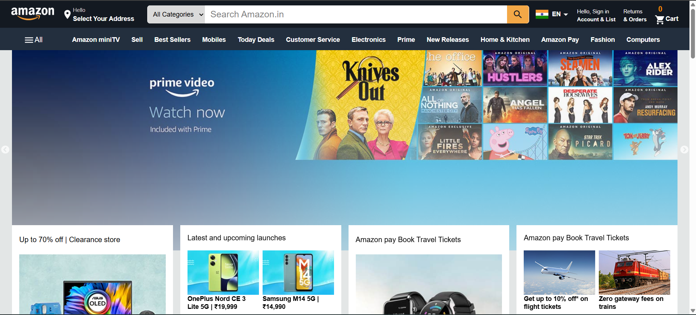
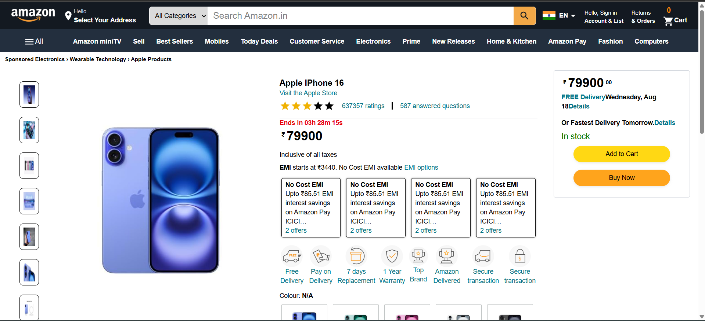
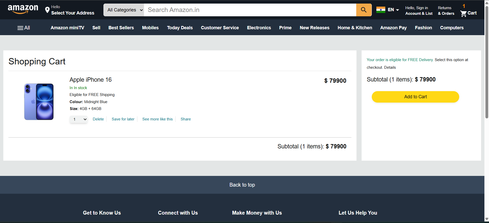

# Amazon Clone

**React + Tailwind CSS**

A simple Amazon-like product listing and detail storefront built with React and Tailwind CSS. This README assumes a Vite-based React project but can be adapted for Create React App.

---

## 📸 Screenshots

### Home Page



### Product Page



### Cart Page

## 

## Features

- Product listing grid with search and category filters
- Product detail page with image gallery, description, price, and add-to-cart
- Shopping cart with quantity controls and localStorage persistence
- Responsive layout (mobile/tablet/desktop)
- Tailwind CSS utilities and responsive design
- (Optional) Authentication, checkout flow, and API integration

---

## Tech Stack

- React (Vite)
- Tailwind CSS
- React Router
- Zustand / Context API (or Redux) — optional for state management
- Axios / Fetch for network requests
- localStorage for cart persistence

---

### Installation

```bash

# Install dependencies
npm install
# or
# pnpm install
# yarn
```

### Development

```bash
npm run dev
# open http://localhost:5173
```

### Build

```bash
npm run build
# serve the build output or deploy
```

## Project Structure (suggested)

```
src/
├─ assets/
├─ components/
├─ pages/
├─ hooks/
├─ store/
├─ utils/
├─ App.jsx
├─ main.jsx
└─ index.css
```

---
